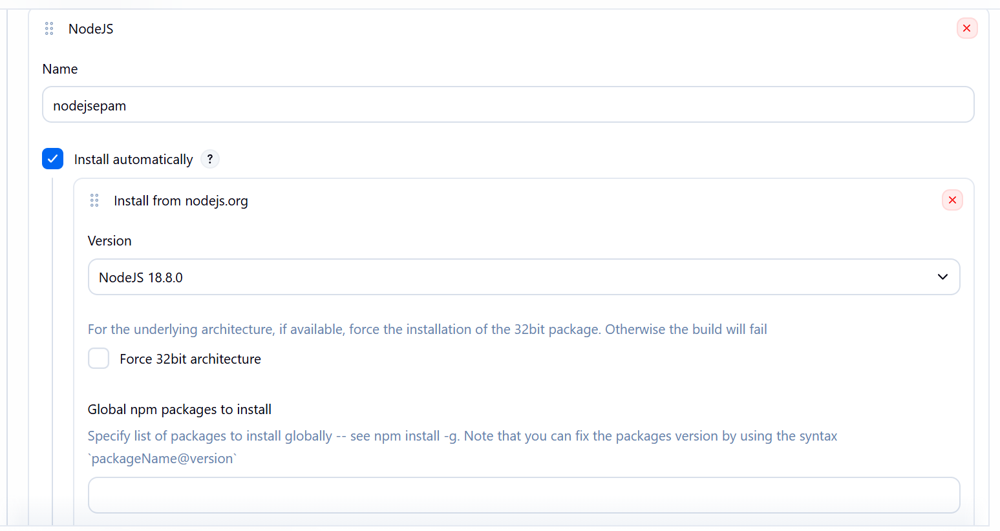
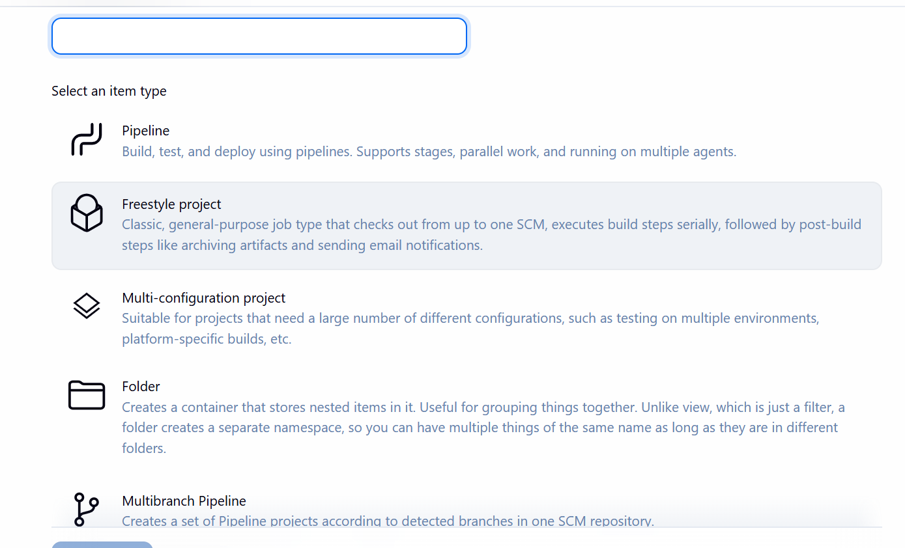
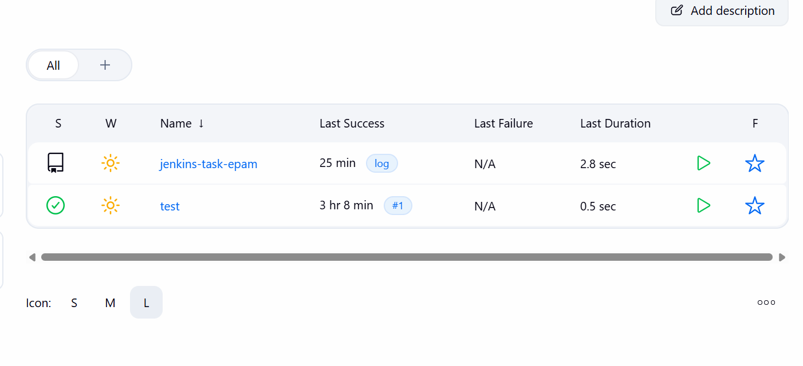
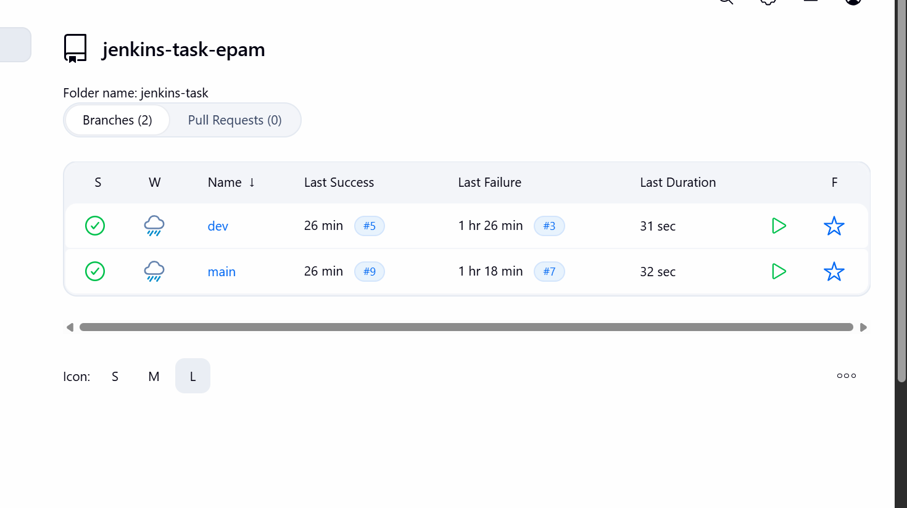
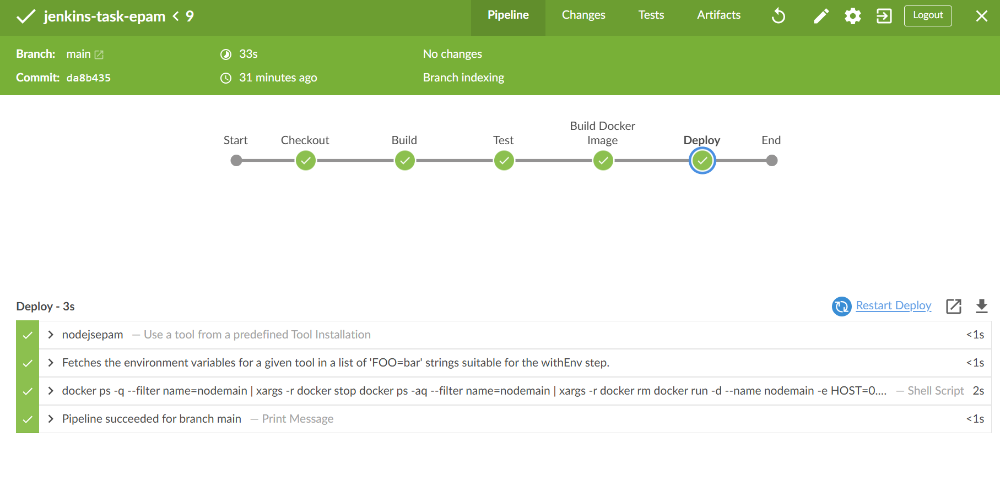
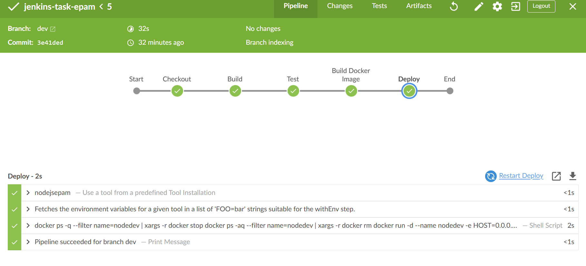

# CICD Pipeline Implementation Documentation

## Project Overview
This document describes the implementation of a Multibranch CICD pipeline and a manual deployment pipeline for automating application deployment using Jenkins, Docker, and GitHub.

---

## Prerequisites Implemented

| Requirement | Status |
|-------------|--------|
| Git installed and configured | ✅ |
| Docker installed | ✅ |
| Jenkins installed on Windows | ✅ |
| GitHub account created | ✅ |
| NodeJS configured in Jenkins | ✅ |

---

## Jenkins Configuration

### Plugins Installed
- Blue Ocean
- Docker Pipeline
- Docker Plugin
- Git Plugin
- NodeJS Plugin
- Pipeline Plugin

### Tools Configured

**NodeJS Configuration in Jenkins:**
- **Name:** `nodejsepam`
- **Installation:** Automatic from nodejs.org
- **Version:** NodeJS 18.x



---

## Repository Structure

### GitHub Repository
**URL:** `https://github.com/opratyush12/cicd-pipeline-jenkins`

### Branch Structure

| Branch | Logo Color | Port | Docker Image |
|--------|-----------|------|--------------|
| `main` | Blue (Circle) | 3000 | `nodemain:v1.0` |
| `dev` | Red (Square) | 3001 | `nodedev:v1.0` |

### File Structure
```
cicd-pipeline-jenkins/
├── Jenkinsfile              # Multibranch pipeline
├── Jenkinsfile.manual       # Manual deployment pipeline
├── Dockerfile               # Docker image configuration
├── package.json             # Node.js dependencies
├── public/
│   └── logo.svg            # Different logo per branch
└── app.js                   # Application source code
```

---

## Pipeline Files

### 1. Jenkinsfile (Multibranch Pipeline)

```groovy
pipeline {
    agent any

    tools {
        nodejs 'nodejsepam'
    }

    stages {
        stage('Checkout') {
            steps {
                checkout scm
            }
        }

        stage('Build') {
            steps {
                sh 'npm install --legacy-peer-deps'
            }
        }

        stage('Test') {
            steps {
                sh 'CI=true npm test || echo "No tests configured"'
            }
        }

        stage('Build Docker Image') {
            steps {
                script {
                    def imageName = (env.BRANCH_NAME == 'main') ? 'nodemain' : 'nodedev'
                    sh "docker build -t ${imageName}:v1.0 ."
                }
            }
        }

        stage('Deploy') {
            steps {
                script {
                    def imageName = (env.BRANCH_NAME == 'main') ? 'nodemain' : 'nodedev'
                    def appPort   = (env.BRANCH_NAME == 'main') ? '3000'     : '3001'

                    sh """
                        docker ps -q --filter name=${imageName} | xargs -r docker stop
                        docker ps -aq --filter name=${imageName} | xargs -r docker rm
                        docker run -d --name ${imageName} \
                            -e HOST=0.0.0.0 \
                            -e PORT=3000 \
                            --expose ${appPort} \
                            -p ${appPort}:3000 \
                            ${imageName}:v1.0
                    """
                }
            }
        }
    }

    post {
        success { echo "Pipeline succeeded for branch ${env.BRANCH_NAME}" }
        failure { echo "Pipeline failed for branch ${env.BRANCH_NAME}" }
    }
}
```

### 2. Jenkinsfile.manual (Manual Deployment Pipeline)

```groovy
pipeline {
    agent any

    parameters {
        choice(name: 'BRANCH', choices: ['main', 'dev'], description: 'Target branch/environment')
        string(name: 'IMAGE_TAG', defaultValue: 'v1.0', description: 'Docker image tag')
    }

    stages {
        stage('Checkout') {
            steps {
                git branch: "${params.BRANCH}", 
                    url: 'https://github.com/opratyush12/cicd-pipeline-jenkins.git'
            }
        }

        stage('Build') {
            steps {
                sh 'npm install --legacy-peer-deps'
            }
        }

        stage('Test') {
            steps {
                sh 'CI=true npm test || echo "No tests configured"'
            }
        }

        stage('Build Docker Image') {
            steps {
                script {
                    def imageName = (params.BRANCH == 'main') ? 'nodemain' : 'nodedev'
                    sh "docker build -t ${imageName}:${params.IMAGE_TAG} ."
                }
            }
        }

        stage('Deploy') {
            steps {
                script {
                    def imageName = (params.BRANCH == 'main') ? 'nodemain' : 'nodedev'
                    def appPort   = (params.BRANCH == 'main') ? '3000'     : '3001'

                    sh """
                        docker ps -q --filter name=${imageName} | xargs -r docker stop
                        docker ps -aq --filter name=${imageName} | xargs -r docker rm
                        docker run -d --name ${imageName} \
                            -e HOST=0.0.0.0 \
                            -e PORT=3000 \
                            --expose ${appPort} \
                            -p ${appPort}:3000 \
                            ${imageName}:${params.IMAGE_TAG}
                    """
                }
            }
        }
    }

    post {
        success { echo "Manually deployed ${params.BRANCH} with tag ${params.IMAGE_TAG}" }
        failure { echo "Deployment failed for ${params.BRANCH}" }
    }
}
```

### 3. Dockerfile

```dockerfile
FROM node:14-alpine
WORKDIR /app
COPY package*.json ./
RUN npm install
COPY . .
ARG PORT=3000
ENV PORT=$PORT
EXPOSE $PORT
CMD ["npm", "start"]
```

---

## Jenkins Pipeline Setup

### Step 1: Create Multibranch Pipeline

1. Click **New Item** on Jenkins dashboard
2. Enter name: `CICD`
3. Select **Multibranch Pipeline**
4. Click **OK**



### Step 2: Configure Repository

1. Under **Branch Sources**, click **Add source** → **Git**
2. Enter Repository URL: `https://github.com/opratyush12/cicd-pipeline-jenkins.git`
3. Credentials: None (public repository)

### Step 3: Build Configuration

- **Mode:** By Jenkinsfile
- **Script Path:** `Jenkinsfile`

### Step 4: Scan and Build

1. Click **Save**
2. Click **Scan Multibranch Pipeline Now**
3. Jenkins will discover both `main` and `dev` branches





### Step 5: Pipeline Execution Results

**Main Branch Build:**


**Dev Branch Build:**


---

## Deployment Results

### Application Access Points

| Environment | URL | Logo Display |
|-------------|-----|--------------|
| Production (main) | `http://localhost:3000` | Blue Circle with "MAIN" |
| Development (dev) | `http://localhost:3001` | Red Square with "DEV" |

### Docker Images Created

```bash
# List Docker images
docker images

# Output:
# nodemain    v1.0    [image-id]
# nodedev     v1.0    [image-id]
```

### Running Containers

```bash
# Check running containers
docker ps

# Output:
# nodemain    running on port 3000
# nodedev     running on port 3001
```

---

## Pipeline Stages Explained

| Stage | Purpose | Commands |
|-------|---------|----------|
| **Checkout** | Clone repository from GitHub | `checkout scm` |
| **Build** | Install Node.js dependencies | `npm install` |
| **Test** | Run unit tests | `npm test` |
| **Build Docker** | Create Docker image | `docker build` |
| **Deploy** | Run container with environment-specific port | `docker run` |

---

## Environment Differences

### Branch-based Configuration

```groovy
// Port selection based on branch
def appPort = (env.BRANCH_NAME == 'main') ? '3000' : '3001'

// Docker image naming based on branch
def imageName = (env.BRANCH_NAME == 'main') ? 'nodemain' : 'nodedev'

// Logo.svg is different in each branch (committed to GitHub)
```

---

## Manual Deployment Pipeline

### How to Use

1. Navigate to `CD_deploy_manual` pipeline
2. Click **Build with Parameters**
3. Select parameters:
   - **BRANCH:** `main` or `dev`
   - **IMAGE_TAG:** `v1.0` (or custom tag)
4. Click **Build**

### Parameters

| Parameter | Options | Default | Description |
|-----------|---------|---------|-------------|
| BRANCH | main, dev | - | Target environment |
| IMAGE_TAG | any string | v1.0 | Docker image version |

---

## Verification Commands

### Test Deployments

```bash
# Check main branch application
curl http://localhost:3000

# Check dev branch application
curl http://localhost:3001

# View Docker logs for main
docker logs nodemain

# View Docker logs for dev
docker logs nodedev
```

### Browser Access

- **Main Branch:** `http://localhost:3000` → Blue logo with "MAIN"
- **Dev Branch:** `http://localhost:3001` → Red logo with "DEV"

---

## Troubleshooting

### Common Issues and Solutions

| Issue | Solution |
|-------|----------|
| `npm: not found` | Configure NodeJS in Jenkins Tools |
| Port already in use | Stop existing containers: `docker stop nodemain nodedev` |
| Docker permission denied | Add Jenkins user to docker group |
| Pipeline not finding branches | Click "Scan Multibranch Pipeline Now" |

---

## Conclusion

Successfully implemented:
- ✅ Multibranch pipeline (`CICD`) with automatic triggers
- ✅ Manual pipeline (`CD_deploy_manual`) with parameterized builds
- ✅ Environment-specific ports (3000 for main, 3001 for dev)
- ✅ Different logos per branch (Blue MAIN, Red DEV)
- ✅ Docker image management with versioning
- ✅ Automated build, test, and deployment stages

---


